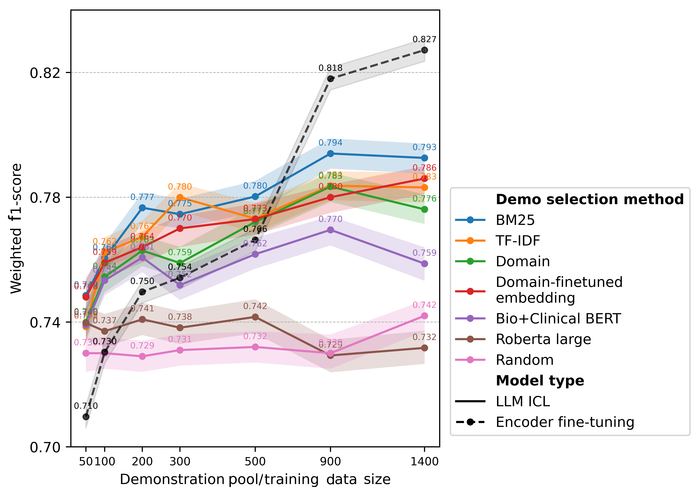
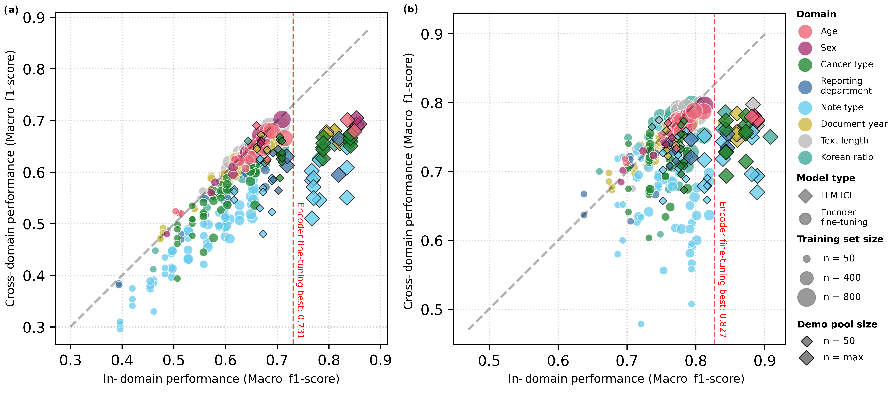
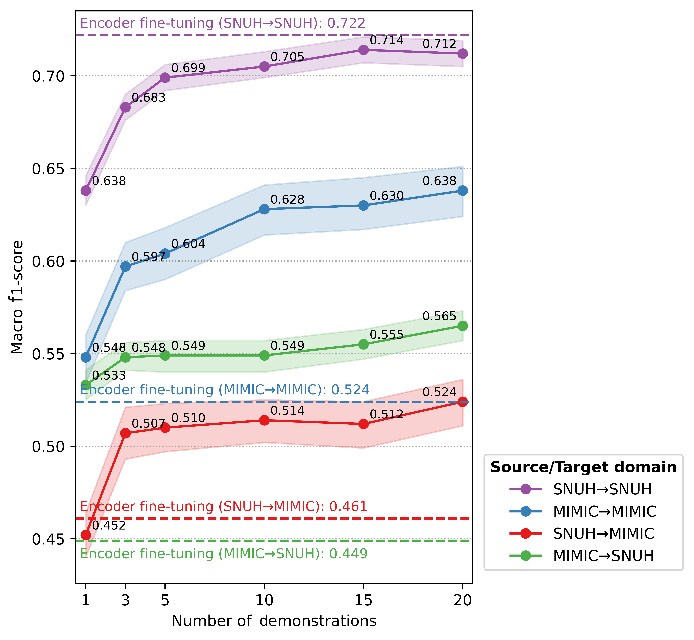

# Clinical Information Extraction: In-Context Learning vs Fine-Tuning

This repository contains the implementation code for the paper "Optimized in-context learning outperforms fine-tuning for clinical information extraction across multi-domain and cross-institutional settings" (under review at npj Digital Medicine).

## Abstract

Clinical information extraction from unstructured electronic health records is essential for healthcare analytics but traditionally requires extensive manual annotation and model fine-tuning. Large language models (LLMs) with in-context learning (ICL) offer a potentially more efficient alternative. This study systematically compares ICL using LLaMA-3.3-70B against encoder-based fine-tuning across varying annotation budgets, clinical domains, and institutions using 2,113 hematology-oncology notes from Seoul National University Hospital and 397 MIMIC-IV discharge summaries.

## Key Findings

- **ICL outperforms fine-tuning** in moderate-resource conditions (up to 6.5 percentage points improvement in F1-score with 200 examples)
- **Domain-aligned demonstration selection** using BM25 retrieval achieves superior performance
- **Cross-institutional generalization** is better with ICL compared to fine-tuning
- **Data efficiency**: ICL achieves comparable performance with substantially fewer labeled samples

## Key Components

### 1. In-Context Learning Pipeline (`llm_inference/`)

- **Demonstration Selection**: Multiple methods including BM25, TF-IDF, embedding-based similarity, and domain matching
- **Prompt Generation**: Two architectures with entity-specific descriptions and optimized final instructions:
  - **Base Prompts** (`prompt_formats/base_prompts/`): Essential task instructions with descriptions for 8 clinical entity types and format-specific guidance
  - **Full Prompts** (`prompt_formats/full_prompts/`): Enhanced structure with entity grouping, confusing cases guidance, and detailed annotation guidelines

- **LLM Inference**: Integration with LLaMA models via Ollama API with optimized parameters
- **Output Parsing**: Robust parsing of various output formats (entity lists, tagged text, JSON)

### 2. Fine-Tuning Pipeline (`bert_finetuning/`)

- **Model Architectures**: Support for BERT, RoBERTa, Korean medical BERT variants, BiLSTM-CRF
- **Training Framework**: Hyperparameter tuning, early stopping, cross-validation
- **Evaluation**: Comprehensive metrics with bootstrap confidence intervals

### 3. Domain Analysis (`subgroups/`)

- **Stratification**: Eight domain variables including demographics, document types, and clinical characteristics
- **Robustness Evaluation**: In-domain vs. cross-domain performance analysis
- **Correlation Analysis**: Statistical analysis of domain relationships

## Results Summary

Our comprehensive evaluation across 2,113 hematology-oncology notes and 397 MIMIC-IV discharge summaries demonstrates that optimized in-context learning represents a significant advancement over traditional encoder-based fine-tuning. When demonstrations are selected using lexical retrieval methods, particularly BM25, ICL consistently outperforms fine-tuning across multiple evaluation scenarios. In moderate-resource settings with 200 annotated examples, ICL achieves up to 6.5 percentage points higher F1-scores compared to fine-tuning, challenging the conventional wisdom that fine-tuning becomes superior with moderate amounts of labeled data.

<div align="center">

</div>

*Performance comparison between in-context learning and fine-tuning across varying annotation budgets and demonstration selection methods.*

The study reveals that ICL's effectiveness stems primarily from sophisticated demonstration selection rather than prompt engineering. While incorporating detailed entity definitions and annotation guidelines into prompts yields only marginal improvements, the choice of demonstration selection method dramatically impacts performance. BM25-based lexical retrieval consistently outperforms embedding-based approaches, TF-IDF, and random selection, achieving up to 9.4 percentage points improvement in macro F1-scores over random demonstration selection. This finding suggests that lexical similarity better captures the relevant contextual patterns for clinical information extraction than semantic embedding approaches.

<div align="center">

</div>

*Domain-specific performance variation in in-context learning across different clinical categories.*

Domain-specific analysis reveals that ICL exhibits remarkable data efficiency when demonstrations are aligned with the target domain. In scenarios where both training and demonstration selection are restricted to specific clinical domains (such as particular note types or cancer categories), ICL achieves performance levels that match or exceed fine-tuning on the complete dataset while requiring substantially fewer labeled samples. This finding has significant implications for clinical NLP deployment, where domain-specific annotation can be both expensive and time-consuming.

<div align="center">

</div>

*In-domain vs. cross-domain performance comparison between ICL and encoder fine-tuning.*

Cross-institutional evaluation provides compelling evidence for ICL's superior generalization capabilities. When transferring between Seoul National University Hospital and MIMIC-IV datasets, ICL demonstrates better robustness to distributional shifts compared to fine-tuning. In SNUH→MIMIC transfer, ICL achieves macro F1-score of 0.524 vs. fine-tuning's 0.461, while MIMIC→SNUH transfer shows even larger performance gaps (0.565 vs. 0.449). These results suggest that ICL's reliance on demonstration examples rather than learned parameters makes it inherently more adaptable to new institutional contexts, addressing a critical challenge in clinical NLP deployment.



*Cross-institutional performance of in-context learning under varying number of demonstrations.*

Our investigation into annotation efficiency reveals that informed selection of documents for annotation can achieve substantial cost savings. By prioritizing documents based on their lexical similarity to the target test set, we demonstrate that comparable performance can be achieved with approximately half the annotation budget compared to random sampling. This finding provides actionable guidance for resource-constrained healthcare environments where annotation budgets are limited.

## Citation

```bibtex
@article{kim2024optimized,
  title={Optimized in-context learning outperforms fine-tuning for clinical information extraction across multi-domain and cross-institutional settings},
  author={Kim, Siun and Lee, Davide Seung U and Yoon, Hyung-Jin and Lee, Howard},
  journal={Under review},
  year={2025},
  note={Under review}
}
```

## Data Availability
- **MIMIC-IV Corpus**: Will be made publicly available via PhysioNet upon publication
- **SNUH Corpus**: Not publicly available due to patient privacy restrictions

## Contact
For questions regarding this research, please contact:
- Siun Kim: shiuhn95@snu.ac.kr
